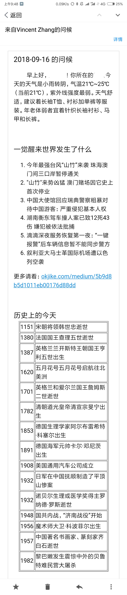
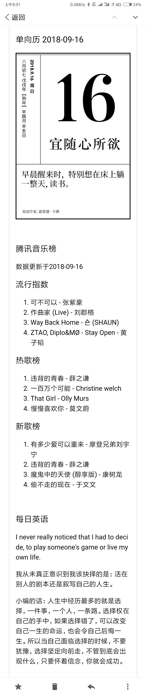

# greet-mail v1.0
Greet your friends every moning!

通过这个程序，可以给你的朋友通过邮件的方式发早安问候，主要使用爬虫在各大网站上爬取信息，因为很多不需要反复爬取，而且邮件发送设置了有延时，并不会对网站造成负荷或是被禁止访问等，目前我添加了天气提示、一觉醒来世界发生了什么、历史上的今天、单向历、音乐排行榜、bing每日壁纸等功能。

手机邮件的界面略览如下

## 每天早晨给你自己和你的朋友来一个，是不是很棒！

---

觉得不错给个Star?
